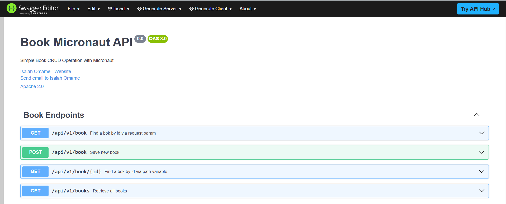

# Simple Book Micronaut CRUD App

## Swagger UI


- http://localhost:8086/swaggerYAML/book-micronaut-api-0.0.yml
- http://localhost:8086/swaggerYAML/views/swagger-ui/index.html


## Endpoints

- http://localhost:8086/api/v1/book
- http://localhost:8086/api/v1/books
- http://localhost:8086/api/v1/book/1


## Running the App

Navigate to the root directory of the project in a terminal, then run:

```
 mvn exec:exec

```
OR:

```
 .\mvnw mn:run

```

## Packaging and running the application

Run the following commands in the root directory to package and run the application as a .jar file

```
mvn clean package

java -jar target/book-micronaut-crude-app-0.1.jar

```

Running with Custom Arguments:

```
java -jar target/book-micronaut-crude-app-0.1.jar -Dmicronaut.server.port=8081 -Dmicronaut.environments=prod

```

## Contributor

| Name         | Email                                       | Contact         | Github                                   |
|--------------|---------------------------------------------|-----------------|------------------------------------------|
| Isaiah Omame | omameazy@gmail.com,<br/> omameazy@yahoo.com | +234 7060812940 | [github](https://github.com/OmameIsaiah) |


